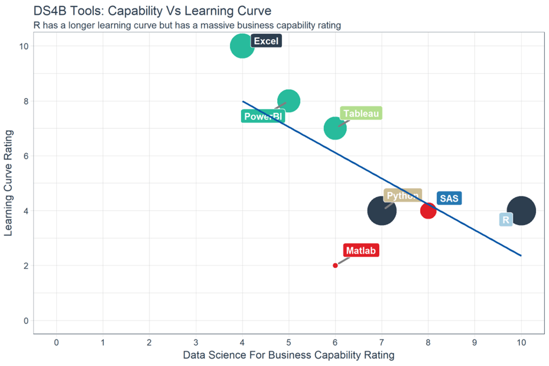

\newline
&nbsp;
&nbsp;
&nbsp;
\newline

## __R__ sebagai Bahasa Pemrograman 

&nbsp;
&nbsp;

__R__ adalah bahasa pemrograman yang dikembangkan mulai tahun 1993 oleh Ross Ihaka dan Robert Gentleman. Menurut situs resmi [cran-R](http://cran.r-project.org), bahasa pemrograman R dikembangkan untuk mendukung pengolahan berbagai metode statistik dan grafis. Bahasa pemrograman R memiliki banyak _library_ untuk pengolahan statistik seperti statistik inferensia, data analytics hingga pengolahan _machine learning_. Bahasa __pemrograman R__ dapat dijalankan pada berbagai sistem operasi, baik Windows, MacOS, ataupun UNIX 

Bahasa __pemrograman R__ kini bukan hanya digunakan di kalangan akademisi yang umumnya ingin menggunakan piranti lunak secara __*Free*__, tetapi sudah digunakan juga oleh sejumlah perusahaan besar seperti Uber, Google, Airbnb, Facebook dan masih banyak lainnya. Hal ini tentunya karena permograman R memiliki kemampuan yang dibutuhkan oleh seorang data analis untuk melakukan aktivitas _data analytics_ meliputi _programming, transforming, discovering, modeling dan communicate_.

&nbsp;
&nbsp;
&nbsp;

# Tentukan Pilihanmu di #2019Pemrograman
&nbsp;
&nbsp;

Piranti lunak untuk membantu seorang data analis dalam pengolahan data adalah sebuah kebutuhan. Ada banyak piranti lunak yang bisa dipilih dan digunakan, namun pilihan tersebut tentunya memiliki konsekuensinya masing-masing. Menurut salah satu sumber belajar [guru99](https://www.guru99.com/r-tutorial.html), [R]() memiliki kemampuan data analytics yang lebih baik dari sejumlah piranti lunak lainnya, namun kelemahannya adalah membutuhkan kurva belajar yang lebih panjang dibanding bahasa pmrograman atau piranti lunak lainnya. 

Bagi seorang data science, kini ada dua pilihan piranti lunak yang bisa dipilih: __Python__ atau __R__. Mengutip apa yang disampaikan oleh [guru99]() (bukan [core of the core atau intinya inti]()), seorang data science tidak perlu mempelajari keduanya, bahkan bagi seseorang yang ingin fokus pada __data science saja__, maka mempelajari dan __memahami algoritma dan pemodelan statistik__ __*lebih utama*__ daripada mempelajari bahasa pemrograman karena bahasa pemrograman hanyalah alat bantu untuk menghitung atau mengolah dan mengkomunikasikan hasil pengolahan data. Aktivitas utama bagi seorang data analis adalah bagaimana memahami, memanipulasi dan menyajikan data dengan pendekatan yang tepat, dengan serangkaian aktivitas yakni: import, clean, preparation, feature engineering, and feature selection. 

Perhatikan bahwa :

1. Pengguna dari hasil pekerjaan seorang data science adalah pelaku bisnis. Mereka umumnya membutuhkan media komunikasi yang baik untuk memahami hasil suatu pengolahan data, baik dalam bentuk laporan tertulis, web, atau aplikasi dashboard. Oleh karena itu, terkadang penggunaan piranti lunak seperti PowerBI atau Tableau sudah sangat powerfull digunakan (meskipun keduanya tidak gratis 100% ). Adapun bila mempertimbangkan dukungan dana yang terbatas, maka R bisa menjadi sebuah pilihan dibanding Python karena kemampuan presentasi hasil sedikit lebih baik.

2. Pemrograman R memang dahulu terbilang cukup sulit digunakan, namun karena semakin banyaknya library siap pakai yang telah dikembangkan oleh sejumlah pihak, maka membuat suatu pengolahan data statistik dan grafik bukanlah hal menyulitkan lagi.  

3. Algoritma-algoritma terbaik untuk _machine learning_ kini dapat digunakan menggunakan R. 

4. R juga dapat berkomunikasi dan memanggil bahasa pemrograman lain seperti Python, Java, C++. Bahkan isu terkini seperti _big data_ juga dapat diakses oleh pemorgraman R karena kemampuannya untuk mengakses data skala besar yang ditangani oleh Spark atau Hadoop.

5. R juga memiliki kemampuan melakukan proses pengolahan data secara pralalel, meskipun salah satu kelemahannya ada pada ketidakmampuan menggunakan menggunakan banyak CPU pada satu waktu. 

Singkatnya, R adalah alat yang luar biasa untuk eksplorasi dan investigasi data. Proses elaborasi dataseperti clustering, correlation, dan data reduction dapat dilakukan oleh R, dan hal tersebut adalah bagian terpenting karena tanpa adanya hasil awal terkait elaborasi data, maka pengembangan suatu _machine learning_ tidak dapat bermakna.

Tq2