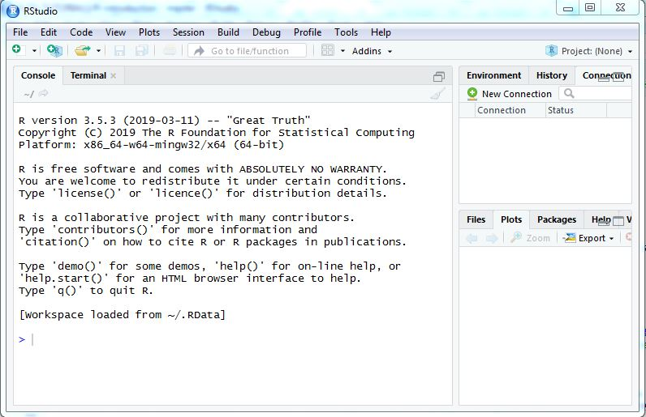

\newline
&nbsp;
&nbsp;
&nbsp;
\newline

## Bagaimana memulai belajar R ? 

 (Sumber: https://heritage.kai.id/page/lawang-sewu)

## Perlu Pintu milik Doraemon ?

 (Sumber: http://pekanbaru.tribunnews.com/2017/03/23/video-pintu-kemana-saja-milik-doraemon-didunia-nyata-begini-sensasinya)

\newline
&nbsp;
&nbsp;
\newline

Tentu saja mulailah dengan melakukan instalasi program R dan RStudio pada komputer Anda. 
\newline
&nbsp;
&nbsp;
\newline

## 1. Instalasi program R

Cara di bawah ini dapat Anda lakukan untuk melakukan instalasi program R dan R Studio.

#### Unduh dan install program [R](https://cran.r-project.org/) 

Silahkan menuju alamat [https://cran.r-project.org/](https://cran.r-project.org/). Pilih R sesuai sistem operasi yang ada pada komputer Anda.

> * R for Linux
> * [R for (Mac) OS X](https://cran.r-project.org/bin/macosx/)
> * [R for Windows](https://cran.r-project.org/bin/windows/). 
> Bagi pengguna sistem operasi Windows, ada dapat langsung menuju halaman [program R di sini](https://cran.r-project.org/bin/windows/base/) kemudian pilihlah link [Download R 3.5.3 for Windows](https://cran.r-project.org/bin/windows/base/R-3.5.3-win.exe) (Asumsi bahwa versi terakhir adalah veri R 3.5.3)    

#### FAQ tentang Instalasi program R

Silahkan install sesuai program dengan mengeksekusi program yang telah Anda unduh. Beberapa pertanyaan umum seputar proses instalasi dapat dibacan pada [halaman ini](https://cran.r-project.org/bin/windows/base/rw-FAQ.html).

Bagi Anda yang lebih senang melihat tatacara instalasi secara visual, silahkan cari di youtube, banyak sekali petunjuk instalasi program R.

## 2. Instalasi program RStudio

RStudio adalah IDE atau interface untuk menuliskan program R, mengeksekusi, bahkan bisa membuat tutorial seperti yang Anda lihat pada saat ini. RStudio juga tersedia untuk sistem operasi Windows, UNIX atau Mac OS X.

Silahkan menuju halaman ini untuk [mengunduh RStudio](https://www.rstudio.com/products/rstudio/download/). Bagi Anda pengguna Windows, silahkan unduh file installer saja agar mudah.

Setelah instalasi selesai, coba jalankan program RStudio sehingga diperoleh halaman pertama seperti ini.

## 3. Setup Area Kerja pada RStudio

RStudio adalah IDE atau interface untuk menuliskan program R, mengeksekusi, bahkan bisa membuat tutorial seperti yang Anda lihat pada saat ini. RStudio juga tersedia untuk sistem operasi Windows, UNIX atau Mac OS X. Sebagai langkah awal, kita akan mengenal terlebih dari bagian-bagian dari Area Kerja pada RStudio. 

* Silahkan Klik menu __File__ --> __New File__ -> __R Script__   

\newline
&nbsp;
&nbsp;
\newline

* Perhatikan bagian-bagian RStudio yang ada.

\newline
&nbsp;
&nbsp;
\newline

__Area Penulisan Script Program__

Pada bagian ini Anda dapat menuliskan program R atau dapat digunakan untuk membuat manual atau tutorial seperti yang dilihat hasilnya saat ini.

__Area Console dan Terminal__

Pada bagian ini Anda dapat menuliskan program script satu persatu dan langsung melihat hasil eksekusinya.

__Area Environment, History, Connection dan Git__

Pada bagian tab Environment, dapat digunakan untu melihat variable atau parameter yang tersimpan pada memori komputer. Pada tab History dapat melihat baris-baris program yang telah dituliskan sebelumnya sehingga dapat kembali digunakan. Tab connection dapat melihat koneksi ke database atau file. Terakhir Tab Git dapat digunakan untuk koneksi ke Git Subversion, misalnya github.com tempat Anda menyimpan program secara cloud.

__Area File, Plot, Packages, Help dan Viewer__

Bagian File berfungsi seperti windows explorer. Bagian Plot bisa dimanfaatkan untuk melihat tampilan plot grafik yang dibuat. Tab Packages untuk melihat paket-paket library yang telah terinstall.

Agar mudah bekerja pada R, disarankan untuk untuk menyimpan Area Kerja dalam bentuk Workspace. Caranya adalah dengan membuat project. __File__ --> __New Project__. Setelah itu tentukan nama dan lokasi folder untuk menyimpan project dan workspace. Setelah itu, setiap kali Anda akan bekerja, cukup membuka pada bagian Recent Project. Secara default sebenarnya RStudio membuka project terakhir yang digunakan.

